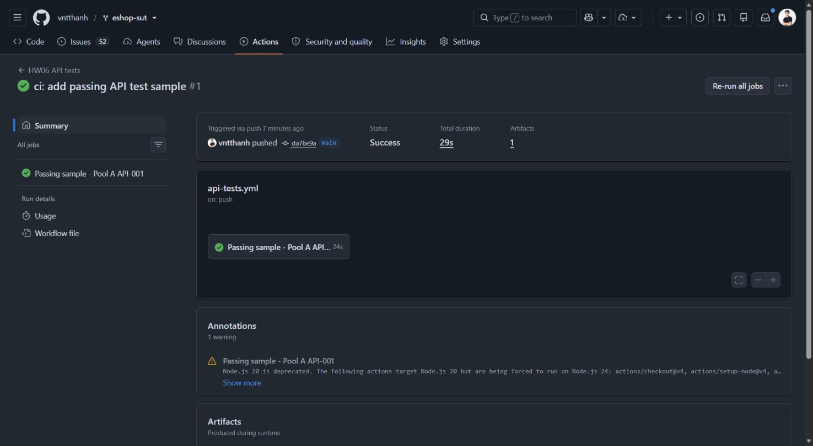
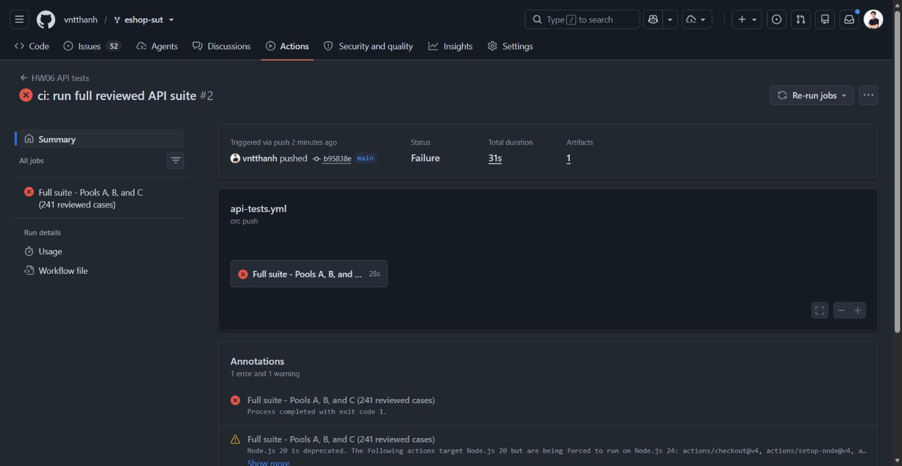

# HW06 CI/CD Report

## Pipeline location and design

The submitted CI demonstration runs in the forked SUT repository:

- **SUT repository:** <https://github.com/vntthanh/eshop-sut>
- **Workflow:** [`.github/workflows/api-tests.yml`](https://github.com/vntthanh/eshop-sut/blob/b95838e79e6f8c300c3366c2daaa755b70b2ab66/.github/workflows/api-tests.yml)
- **Trigger:** every push to `main`, plus manual dispatch
- **Runtime:** Ubuntu, Node.js 20, the EShop backend on `127.0.0.1:3000`, and Newman 6.2.2
- **Required identity header:** `X-Student-Id: 23127261`

The workflow checks out an immutable HW06 test-repository revision, installs the SUT and Newman dependencies, starts the backend, prepares deterministic SQLite fixtures, runs Newman, preserves the exit code, and uploads the generated JSON/HTML reports and SUT log for 30 days.

No SUT defect was fixed or hidden to manufacture the passing result. The first commit intentionally selects one existing reviewed case that passes on the teaching SUT. Its child commit changes only the CI scope to execute the complete reviewed suite; the resulting failure preserves the genuine defect evidence.

## Evidence commit 1 — passing test

| Field | Evidence |
| --- | --- |
| Commit | [`da76e9a42ed523b2506214636f9d456ce1c34225`](https://github.com/vntthanh/eshop-sut/commit/da76e9a42ed523b2506214636f9d456ce1c34225) — `ci: add passing API test sample` |
| Parent SUT commit | `85af3ba875c88283615e22cb108f13e2fccaf0e9` |
| GitHub Actions run | [Run 32615052703](https://github.com/vntthanh/eshop-sut/actions/runs/32615052703) |
| Job | `Passing sample - Pool A API-001` |
| Run time (GMT+7) | 2026-08-23 10:19:14–10:19:43 |
| Result | **Success** |
| Scope | Pool A `API-001`, using the original reviewed request, fixture, and assertion |
| Observed totals | 1 logical test case; 1 SUT request; 1 assertion passed; 0 failed assertions |
| Artifact | `newman-passing-sample-32615052703-1` (15.2 KB; expires after the configured 30-day retention period) |
| Screenshot | [`reports/ci/evidence/passing-sample-run.png`](reports/ci/evidence/passing-sample-run.png) |

The run page identifies commit `da76e9a`, reports `Status: Success`, shows the passing Pool A `API-001` job, and provides the Newman JSON/HTML artifact. This is a real test from the final Pool A collection; it is not a stub or an assertion whose expected result was changed for CI.

## Evidence commit 2 — complete suite with genuine failures

| Field | Evidence |
| --- | --- |
| Commit | [`b95838e79e6f8c300c3366c2daaa755b70b2ab66`](https://github.com/vntthanh/eshop-sut/commit/b95838e79e6f8c300c3366c2daaa755b70b2ab66) — `ci: run full reviewed API suite` |
| Parent commit | `da76e9a42ed523b2506214636f9d456ce1c34225` — exactly the passing-test commit above |
| GitHub Actions run | [Run 32615258699](https://github.com/vntthanh/eshop-sut/actions/runs/32615258699) |
| Job | `Full suite - Pools A, B, and C (241 reviewed cases)` |
| Run time (GMT+7) | 2026-08-23 10:24:16–10:24:47 |
| Result | **Failure** |
| Scope | All final Pool A, Pool B, and Pool C collections |
| Logical cases / collection requests | 241 logical cases / 255 collection leaf requests |
| Actual requests | 478 total, including fixture and post-response state helpers |
| Assertions | 407 total: 356 passed and 51 failed |
| Per-pool exit status | Pool A `1`; Pool B `1`; Pool C `1` |
| Artifact | `newman-full-suite-32615258699-1` (932 KB; JSON/HTML reports for all pools plus SUT log) |
| Screenshot | [`reports/ci/evidence/full-suite-failing-run.png`](reports/ci/evidence/full-suite-failing-run.png) |

The full-suite commit changes the workflow from the one-case selector to all three final collections. It pins HW06 test commit `ad3c2af973c000026cd4ad985b57390d32fdd917`, executes every reviewed Test ID, continues through all pools even after an earlier pool fails, and fails the job only after recording all three exit statuses. The failed assertions correspond to the genuine SUT defects already analyzed in `Main_Report.md` and `Bug_Report.md`; they are not intentionally falsified assertions.

## Result reconciliation

| Pool | Logical cases | Collection requests | Actual requests | Assertions | Passed | Failed |
| --- | ---: | ---: | ---: | ---: | ---: | ---: |
| Pool A — Reset Password | 82 | 88 | 85 | 82 | 59 | 23 |
| Pool B — Discount Coupons | 74 | 74 | 148 | 27 | 7 | 20 |
| Pool C — Admin Order Management | 85 | 93 | 245 | 298 | 290 | 8 |
| **Total** | **241** | **255** | **478** | **407** | **356** | **51** |

The distinction between collection requests and actual requests is expected. Pool A uses three pre-request helper calls, Pool B performs one fixture reset for each of its 74 cases, and Pool C performs 85 fixture resets plus 67 post-response state inspections. These helper calls are part of deterministic test setup and state verification, not additional logical test cases.

## Reproduction

1. Check out SUT commit `da76e9a42ed523b2506214636f9d456ce1c34225` to reproduce the one-case passing run.
2. Check out its child `b95838e79e6f8c300c3366c2daaa755b70b2ab66` to reproduce the full-suite failing run.
3. Run the `HW06 API tests` workflow manually, or push the selected commit to `main` in the SUT fork.
4. Download the uploaded Newman artifact before its 30-day retention period expires.

The final SUT branch intentionally remains at the complete-suite commit, so subsequent CI runs continue to expose the known defects rather than hiding them behind the passing-case selector.
