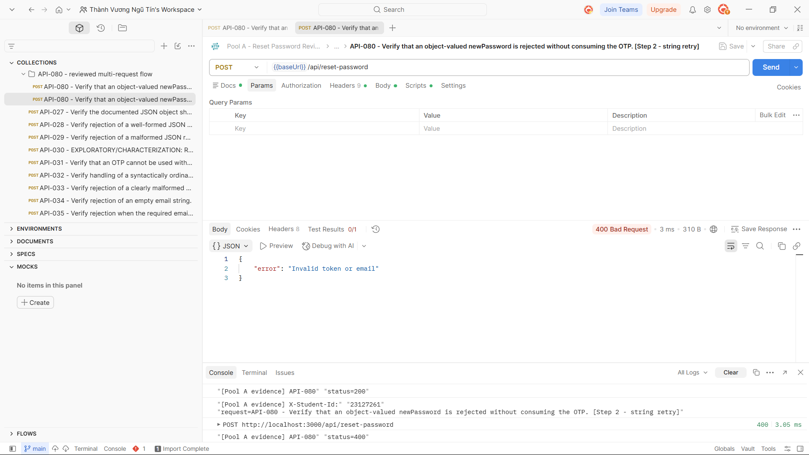

## Bug: Invalid new passwords bypass server-side validation

**Impacted Test Case ID(s):** API-016, API-017, API-018, API-020, API-021, API-022, API-023, API-024, API-046, API-047, API-050, API-052, API-055, API-057, API-060, API-061, API-062, API-067, API-080

### Description

The reset-password endpoint accepts `newPassword` values that are missing, null, non-string, empty, or do not satisfy the required minimum length and character classes. These invalid requests return `200 OK` instead of being rejected. API-080 additionally shows that an object-valued password consumes the one-time reset token, because the subsequent valid retry is rejected.

### Steps to Reproduce

1. Seed a registered account with a valid, unused six-digit reset token.
2. Send `POST /api/reset-password` using the valid email and token while omitting `newPassword`, supplying `null`, a number, an object, an empty string, or a password that violates one or more strength rules.
3. Observe the response and, where applicable, retry with a valid string password using the same token.

### Expected Result

Every invalid `newPassword` request is rejected with `400 Bad Request`; the account password remains unchanged and the reset token remains usable for a corrected request.

### Actual Result

The endpoint returns `200 OK` for the tested invalid `newPassword` values instead of rejecting them. For API-080, the object-valued password receives `200 OK` and the subsequent valid retry receives `400 Bad Request`, demonstrating that the token was consumed by the invalid request.

### Environment

- **Browser/OS:** Newman CLI on Windows (browser not applicable)
- **Version:** EShop requirements v2.0; Newman 6.2.2
