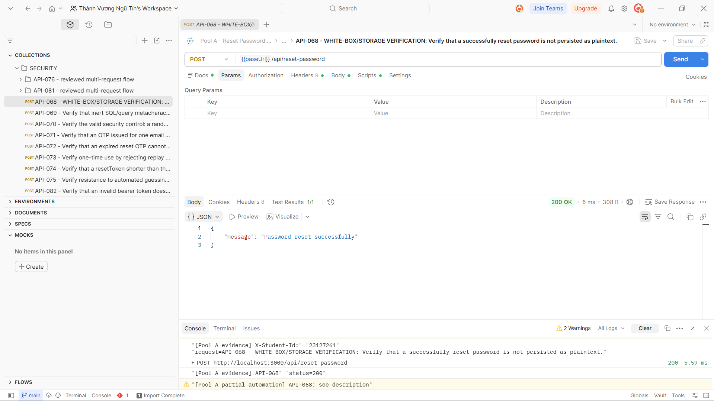
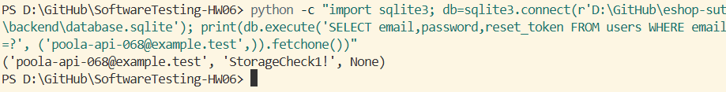

## Bug: Reset passwords are stored in plaintext

**Impacted Test Case ID(s):** API-068

### Description

The reset-password endpoint persists the submitted password value directly rather than storing a secure password hash. This was confirmed through the completed white-box database inspection required by the reviewed test case.

### Steps to Reproduce

1. Seed a registered account with a valid, unused reset token and note its existing password value.
2. Send a valid `POST /api/reset-password` request with a known conforming new password.
3. After the request succeeds, inspect the account's password field directly in the SQLite database.

### Expected Result

The new password is stored using a secure password-hashing mechanism and the submitted plaintext value is not present in password storage.

### Actual Result

The request returns `200 OK`, and direct database inspection shows the exact submitted reset password stored in plaintext.

### Environment

- **Browser/OS:** Newman CLI and direct SQLite inspection on Windows (browser not applicable)
- **Version:** EShop requirements v2.0; Newman 6.2.2
