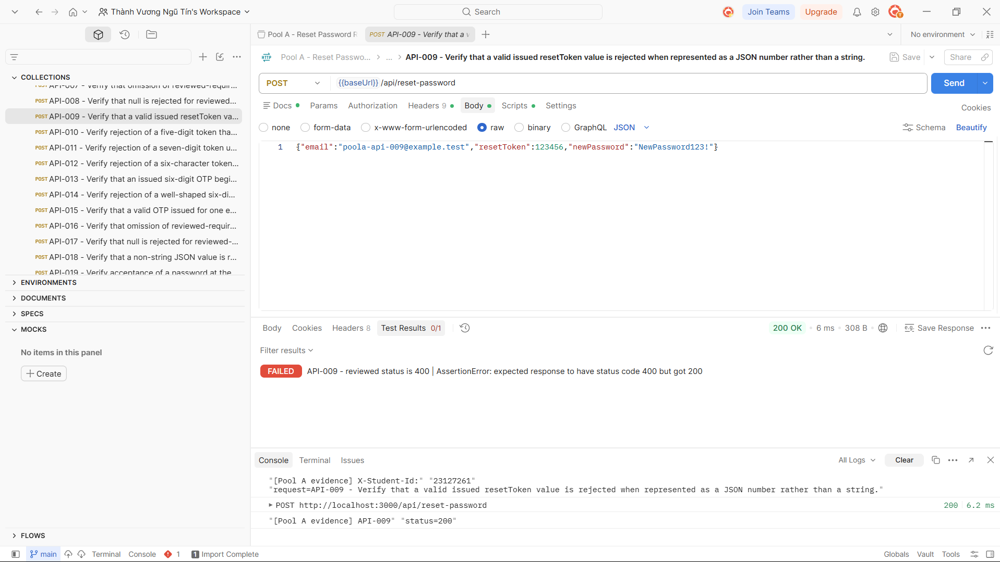

## Bug: Reset token accepts non-string JSON numbers

**Impacted Test Case ID(s):** API-009, API-044

### Description

The reset-password endpoint does not enforce the documented string type for `resetToken`. A valid issued token sent as a JSON number is matched and accepted, allowing the password reset to succeed instead of rejecting the invalid representation.

### Steps to Reproduce

1. Seed a registered account with a valid, unused six-digit reset token stored as text.
2. Send `POST /api/reset-password` with the registered email, a conforming `newPassword`, and the issued `resetToken` represented as a JSON number rather than a string.
3. Observe the response.

### Expected Result

The request is rejected with `400 Bad Request` because `resetToken` must be a JSON string.

### Actual Result

The endpoint returns `200 OK` and performs the password reset with the numeric token representation.

### Environment

- **Browser/OS:** Newman CLI on Windows (browser not applicable)
- **Version:** EShop requirements v2.0; Newman 6.2.2
