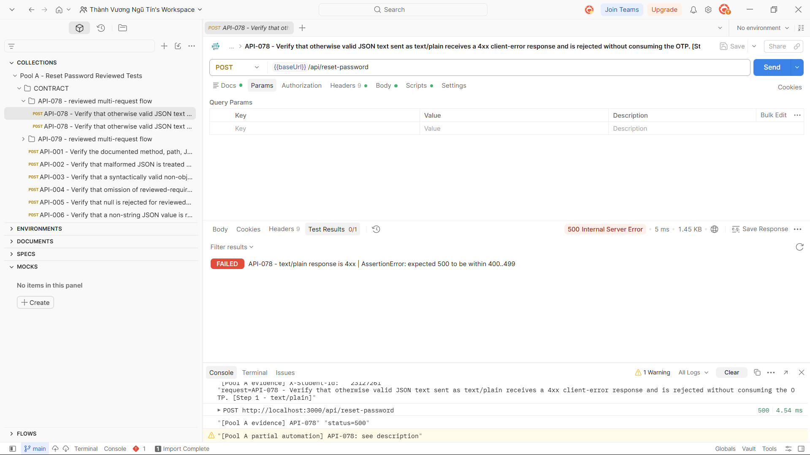

## Bug: Unsupported content type causes an internal server error

**Impacted Test Case ID(s):** API-078

### Description

The reset-password endpoint does not safely reject a JSON-shaped request sent as `text/plain`. It attempts to destructure an unparsed body and produces a server error instead of a client-error response.

### Steps to Reproduce

1. Seed a registered account with a valid, unused six-digit reset token.
2. Send otherwise valid JSON text to `POST /api/reset-password` with `Content-Type: text/plain`.
3. Retry with the same email, token, and password using `Content-Type: application/json`.

### Expected Result

The `text/plain` request receives a safe `4xx` response without consuming the token, and the corrected JSON retry succeeds with `200 OK`.

### Actual Result

The `text/plain` request returns `500 Internal Server Error`. The corrected JSON retry returns `200 OK`, confirming that the failed request did not consume the token.

### Environment

- **Browser/OS:** Newman CLI on Windows (browser not applicable)
- **Version:** EShop requirements v2.0; Newman 6.2.2
