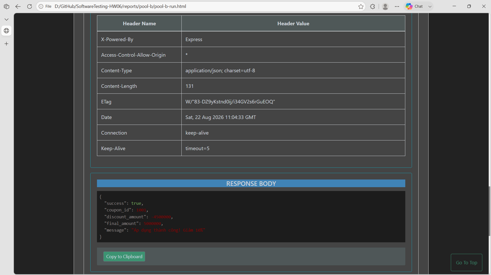

## Bug: Coupon application does not validate JWT credentials

**Impacted Test Case ID(s):** Pool B API-013, API-014, API-020, API-021, API-061, API-062, API-063, API-064

### Description

The apply-coupon endpoint performs coupon evaluation without enforcing the FR-09 C4 and SEC-02 valid-JWT prerequisite. Requests with no token, malformed tokens, invalid signatures, and expired tokens can receive successful discounted calculations.

### Steps to Reproduce

1. Seed an eligible active coupon and a user with remaining usage.
2. Send `POST /api/apply-coupon` without an Authorization header.
3. Repeat with a malformed token, an invalid-signature JWT, and an expired JWT.
4. Observe whether a successful calculation is returned.

### Expected Result

Coupon application is denied unless the request contains a JWT that passes the SUT's validity checks.

### Actual Result

Each missing or invalid credential variant reaches coupon calculation and returns `200 OK` with `discount_amount` and `final_amount`. The Pool B Newman artifact contains the failed automated security assertions and corroborating manual observations.

### Environment

- **Browser/OS:** Newman CLI on Windows (browser not applicable)
- **Version:** EShop requirements v2.0; Newman 6.2.2
