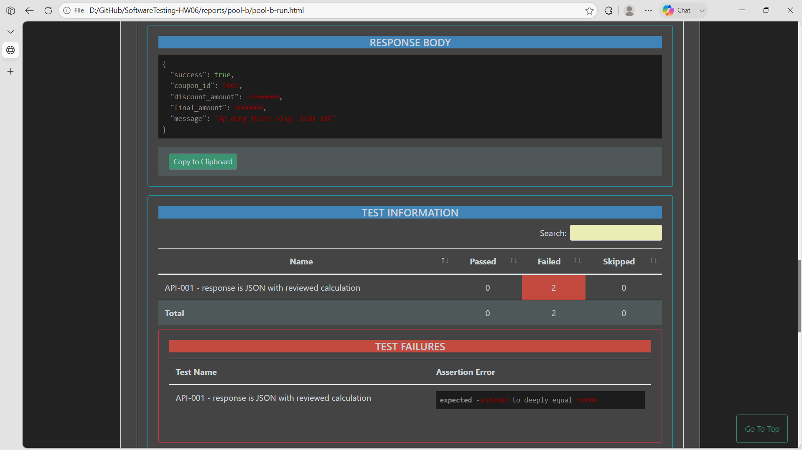

## Bug: Percent coupons use an invalid discount calculation

**Impacted Test Case ID(s):** Pool B API-001, API-016, API-035, API-047, API-051, API-052, API-060, API-073, API-074

### Description

The apply-coupon endpoint calculates percentage discounts incorrectly. Qualifying percent coupons produce zero or negative discount amounts and final amounts greater than the original order total instead of applying `total_amount × discount_value / 100`.

### Steps to Reproduce

1. Seed an active, unexpired percent coupon with remaining per-user usage, such as SAVE10 with `discount_value=10`.
2. Send `POST /api/apply-coupon` with a valid JWT, the coupon code, a qualifying `total_amount`, and a controlled `user_id`.
3. Repeat with representative 1%, 10%, and 100% coupons.
4. Observe `discount_amount` and `final_amount`.

### Expected Result

`discount_amount` equals `total_amount × discount_value / 100`, and `final_amount` equals `total_amount - discount_amount`.

### Actual Result

The endpoint returns invalid values such as `discount_amount=-4500000` and `final_amount=5000000` for SAVE10 on 500000, `discount_amount=0` for a 1% coupon on 500000, and `discount_amount=-49500000` for a 100% coupon. The Pool B Newman artifact records the affected assertion failures and manual observations: [`pool-b-run.json`](../reports/pool-b/pool-b-run.json).

### Environment

- **Browser/OS:** Newman CLI on Windows (browser not applicable)
- **Version:** EShop requirements v2.0; Newman 6.2.2
