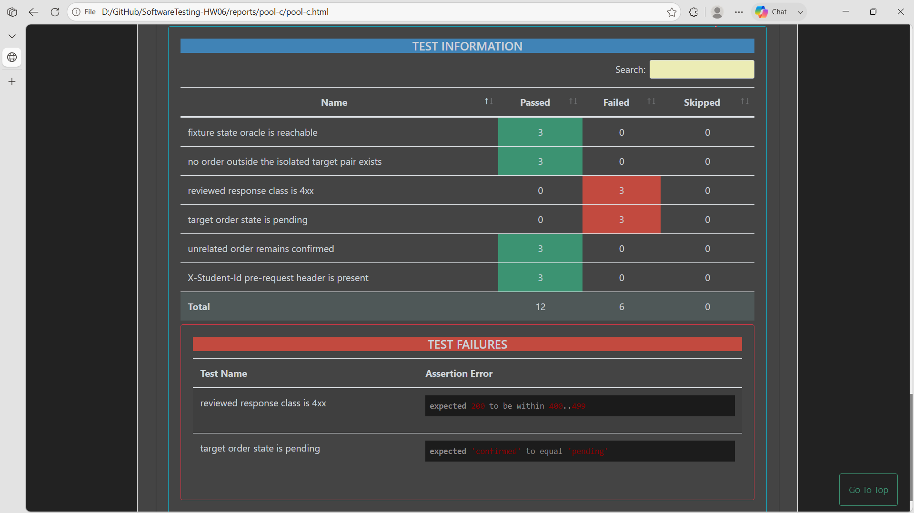

## Bug: Admin role is not enforced for order status updates

**Impacted Test Case ID(s):** API-008, API-034, API-076, API-085

### Description

The Admin order-status endpoint accepts requests bearing valid non-Admin JWTs and performs the protected order mutation instead of denying access.

### Steps to Reproduce

1. Seed an existing order in `pending` state and obtain valid JWTs for a non-Admin user and an Admin user.
2. Send `PUT /api/admin/orders/<existing-pending-order-id>/status` with the non-Admin Bearer token, `Content-Type: application/json`, and body `{"status":"confirmed"}`.
3. Observe the response and query the target order state.
4. For the ordered control flow, retry the same update with the valid Admin Bearer token.

### Expected Result

The non-Admin request is denied and the target order remains `pending`; only the Admin-authorized request may perform the update.

### Actual Result

The non-Admin request is accepted, returns `200 OK` in API-085, and changes the target order from `pending` to `confirmed`. Three independent single-request cases and the ordered two-step flow reproduce the unauthorized mutation in the Pool C Newman artifact.

### Environment

- **Browser/OS:** Newman CLI on Windows (browser not applicable)
- **Version:** EShop requirements v2.0; Newman 6.2.2
