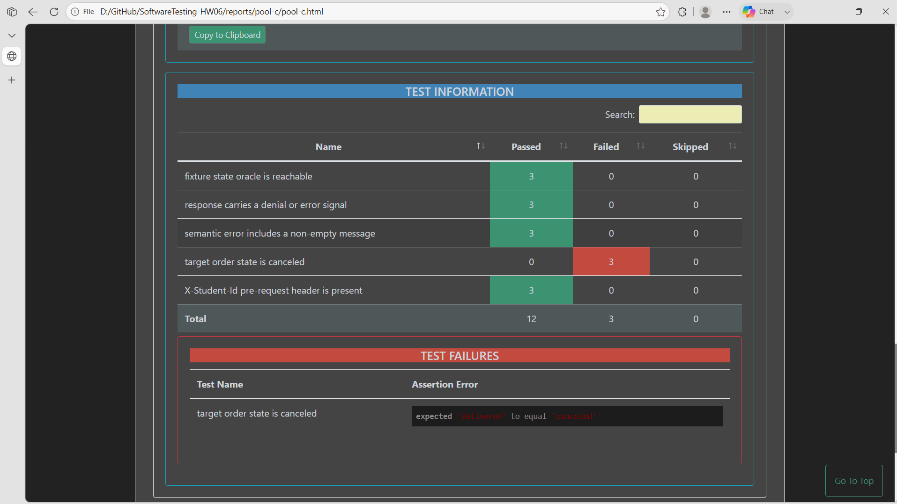

## Bug: Canceled orders can transition to delivered

**Impacted Test Case ID(s):** API-062

### Description

The order-status endpoint accepts a `canceled → delivered` request and changes the stored order state, violating the FR-10 rule that `canceled` is final.

### Steps to Reproduce

1. Seed an existing order in `canceled` state and obtain a valid Admin JWT.
2. Send `PUT /api/admin/orders/<canceled-order-id>/status` with `Authorization: Bearer <valid-admin-JWT>`, `Content-Type: application/json`, and body `{"status":"delivered"}`.
3. Query the order state after the request.

### Expected Result

The transition is rejected and the order remains in the final `canceled` state.

### Actual Result

The endpoint accepts the invalid transition and changes the target order from `canceled` to `delivered`. The Pool C Newman artifact contains the failed final-state assertion.

### Environment

- **Browser/OS:** Newman CLI on Windows (browser not applicable)
- **Version:** EShop requirements v2.0; Newman 6.2.2
