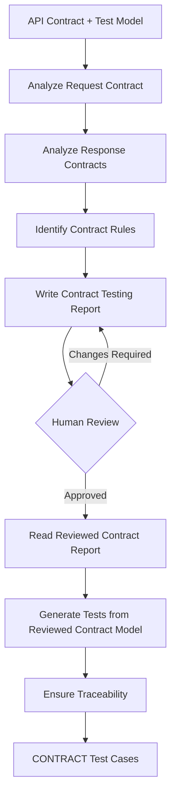

# AI-Driven Contract Test Generator

## 1. Purpose

Generate candidate API test cases using Contract Testing techniques for the selected API endpoint.

This subagent focuses only on contract test cases.

## 2. Inputs

- `api_contract`: the extracted contract of the selected endpoint
- `test_model`: the normalized test model derived from that contract
- `contract_report_path`: location of the Contract Testing report

## 3. Output

A structured set of candidate test cases.

- Test ID
- Endpoint
- Category (CONTRACT)
- Test Objective
- Preconditions
- Request Input
- Expected Result
- Specification Basis
- Assumptions / Notes

## 4. Pseudocode

```text
FUNCTION generate_contract_tests(
    api_contract,
    test_model
):

    request_contract = analyze_request_contract(
        api_contract,
        test_model
    )

    response_contracts = analyze_response_contracts(
        api_contract,
        test_model
    )

    contract_rules = identify_contract_rules(
        request_contract,
        response_contracts
    )

    write_contract_report(
        request_contract,
        response_contracts,
        contract_rules
    )

    STOP FOR HUMAN REVIEW

    reviewed_contract_model =
        read_reviewed_contract_report()

    contract_tests = generate_tests_from_reviewed_contract_model(
        reviewed_contract_model,
        api_contract
    )

    ensure_traceability(
        contract_tests,
        reviewed_contract_model
    )

    RETURN contract_tests
```

## 5. Diagram


