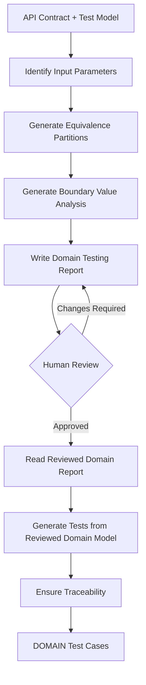

# AI-Driven Domain Test Generator

## 1. Purpose

Generate candidate API test cases using Domain Testing techniques for every input parameter of the selected API endpoint.

This subagent focuses only on domain test cases.

## 2. Inputs

- `api_contract`: the extracted contract of the selected endpoint
- `test_model`: the normalized test model derived from that contract
- `domain_report_path`: location of the Domain Testing report

## 3. Output

A structured set of candidate test cases.

- Test ID
- Endpoint
- Category (DOMAIN)
- Test Objective
- Preconditions
- Request Input
- Expected Result
- Specification Basis
- Assumptions / Notes

## 4. Pseudocode

```text
FUNCTION generate_domain_tests(
    api_contract,
    test_model
):
    parameters = identify_input_parameters(
        api_contract,
        test_model
    )

    equivalence_partitions =
        generate_equivalence_partitions(
            parameters,
            api_contract
        )

    boundary_values =
        generate_boundary_value_analysis(
            parameters,
            api_contract
        )

    write_domain_report(
        parameters,
        equivalence_partitions,
        boundary_values
    )

    STOP FOR HUMAN REVIEW

    reviewed_domain_model =
        read_reviewed_domain_report()

    domain_tests =
        generate_tests_from_reviewed_domain_model(
            reviewed_domain_model,
            api_contract
        )

    ensure_traceability(
        domain_tests,
        reviewed_domain_model
    )

    RETURN domain_tests
```

## 5. Diagram


