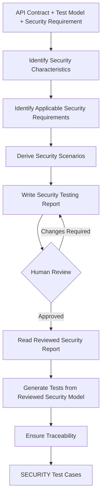

# AI-Driven Security Test Generator

## 1. Purpose

Generate candidate API test cases using the security requirements applicable to the selected API endpoint.

This subagent focuses only on security test cases.

## 2. Inputs

- `api_contract`: the extracted contract of the selected endpoint
- `test_model`: the normalized test model derived from that contract
- `security_requirements`: SEC-01–SEC-07 extracted from the API specification
- `security_report_path`: location of the Security Testing report

## 3. Output

A structured set of candidate test cases.

- Test ID
- Endpoint
- Category (SECURITY)
- Test Objective
- Preconditions
- Request Input
- Expected Result
- Specification Basis
- Assumptions / Notes

## 4. Pseudocode

```text
FUNCTION generate_security_tests(
    api_contract,
    test_model,
    security_requirements
):

    security_characteristics = identify_security_characteristics(
        api_contract,
        test_model
    )

    applicable_requirements = identify_applicable_requirements(
        security_requirements,
        security_characteristics,
        api_contract
    )

    security_scenarios = derive_security_scenarios(
        applicable_requirements,
        security_characteristics,
        api_contract
    )

    write_security_report(
        security_characteristics,
        applicable_requirements,
        security_scenarios
    )

    STOP FOR HUMAN REVIEW

    reviewed_security_model =
        read_reviewed_security_report()

    security_tests = generate_tests_from_reviewed_security_model(
        reviewed_security_model,
        api_contract
    )

    ensure_traceability(
        security_tests,
        reviewed_security_model
    )

    RETURN security_tests
```

## 5. Diagram


