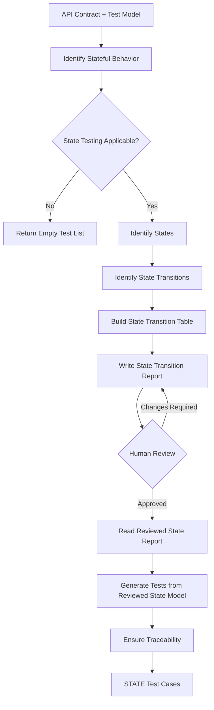

# AI-Driven State Transition Test Generator

## 1. Purpose

Generate candidate API test cases using State Transition Testing techniques for the selected API endpoint when stateful behavior is applicable.

This subagent focuses only on state transition test cases.

## 2. Inputs

- `api_contract`: the extracted contract of the selected endpoint
- `test_model`: the normalized test model derived from that contract
- `state_report_path`: location of the State Transition Testing report

## 3. Output

A structured set of candidate test cases.

- Test ID
- Endpoint
- Category (STATE)
- Test Objective
- Preconditions
- Request Input
- Expected Result
- Specification Basis
- Assumptions / Notes

## 4. Pseudocode

```text
FUNCTION generate_state_tests(
    api_contract,
    test_model
):

    state_behavior = identify_stateful_behavior(
        api_contract,
        test_model
    )

    IF state_behavior is NOT APPLICABLE:
        RETURN empty_list

    states = identify_states(
        state_behavior,
        api_contract
    )

    transitions = identify_state_transitions(
        states,
        state_behavior,
        api_contract
    )

    transition_table = build_state_transition_table(
        states,
        transitions
    )

    write_state_report(
        states,
        transitions,
        transition_table
    )

    STOP FOR HUMAN REVIEW

    reviewed_state_model = read_reviewed_state_report()

    state_tests = generate_tests_from_reviewed_state_model(
        reviewed_state_model,
        api_contract
    )

    ensure_traceability(
        state_tests,
        reviewed_state_model
    )

    RETURN state_tests
```

## 5. Diagram


