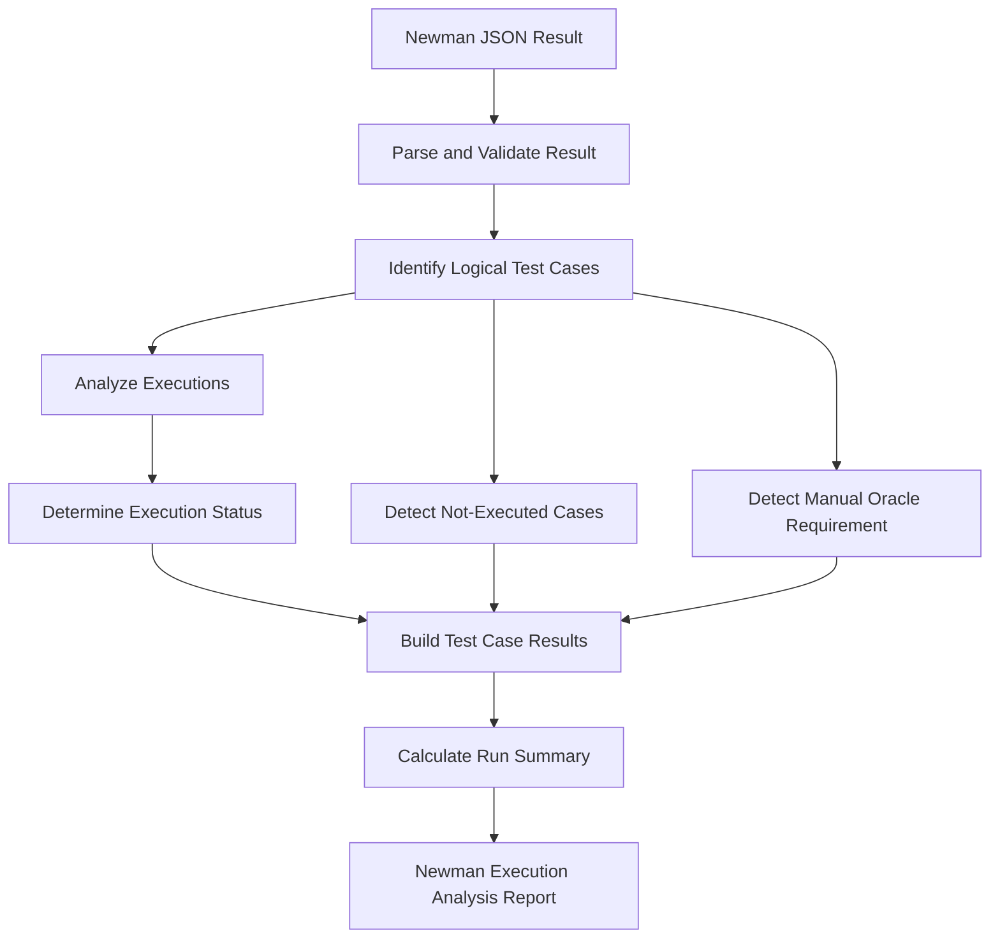

# Newman Result Analyzer

## 1. Purpose

The analyzer takes a Newman JSON execution result as input and produces a normalized execution analysis for the API test cases contained in the run.

The analyzer should distinguish test-execution outcomes from SUT defects. It reports what happened during execution but does not group failures into bugs, assign severity, or infer implementation root causes.

The analysis should support:

- Passing and failing assertions
- Request and script/runtime errors
- Multi-request test flows
- Blocked or not-executed test cases
- Test cases that require a manual or white-box oracle

## 2. Inputs

- Newman JSON execution result
- Output report path

## 3. Output

A structured Newman execution analysis report.

For the run summary:

- Collection name
- Execution time
- Total requests
- Total assertions
- Passed assertions
- Failed assertions
- Request errors
- Pre-request script errors
- Test script errors
- Number of logical test cases with failed automated assertions

For each logical test case:

- Test ID
- Execution Status
- Request / Flow Step
- HTTP Status
- Assertion Result
- Failure / Error Message
- Manual Oracle Required
- Execution Notes

Execution Status should use the following values where applicable:

- `PASS`
- `FAIL_ASSERTION`
- `RUNTIME_ERROR`
- `REQUEST_ERROR`
- `BLOCKED_NOT_EXECUTED`
- `NOT_EXECUTED`

The analyzer may mark a case as requiring a manual oracle independently of its automated execution status.

## 4. Pseudocode

```text
FUNCTION analyze_newman_result(
    newman_json,
    output_report_path
):
    result = parse_newman_json(newman_json)
    IF result is invalid:
        RETURN error

    test_cases = identify_test_cases(result)

    FOR EACH test_case IN test_cases:
        executions = get_executions(test_case)

        IF executions are empty:
            status = determine_not_executed_status(test_case)
        ELSE:
            status = determine_execution_status(executions)

        manual_oracle_required =
            detect_manual_oracle_requirement(test_case)

        record_test_result(
            test_case,
            status,
            executions,
            manual_oracle_required
        )

    summary = calculate_run_summary(
        result,
        test_cases
    )

    write_report(
        output_report_path,
        summary,
        test_cases
    )

    RETURN output_report_path
```

`determine_execution_status()` classifies each logical test case as:

- `PASS`
- `FAIL_ASSERTION`
- `RUNTIME_ERROR`
- `REQUEST_ERROR`

`determine_not_executed_status()` classifies cases as:

- `BLOCKED_NOT_EXECUTED`
- `NOT_EXECUTED`

Manual-oracle requirement is recorded separately from the execution status.

## 5. Diagram


