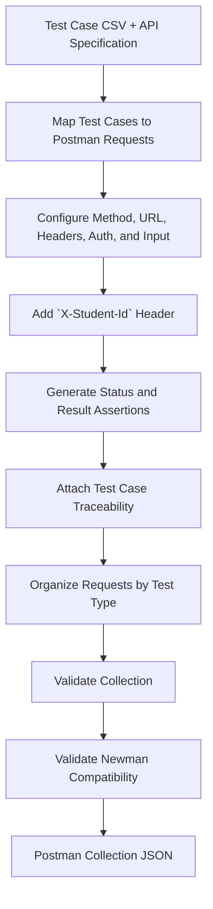

# AI-Driven Postman Test Generator

## 1. Purpose

Convert the final reviewed API test cases in a CSV file into an executable Postman collection.

This supporting agent does not design new test cases. It implements the reviewed test cases as Postman requests and test scripts while preserving traceability to the source CSV. The generated collection must be executable by both Postman and Newman without
requiring manual modification.

## 2. Inputs

- `test_case_csv_path`: path to the final reviewed test-case CSV for one pool
- `api_specification`: API specification used to resolve endpoint, authentication, and contract details
- `conversion_report_path`: location of the Postman conversion report
- `collection_output_path`: location of the generated Postman collection
- `base_url_variable`: Postman base URL variable (default: `{{baseUrl}}`)
- `student_id_variable`: Postman student ID variable (default: `{{studentId}}`)

## 3. Output

An executable Postman Collection v2.1 containing the reviewed test cases.

For each converted test case:

- Request name containing the Test ID and Test Objective
- HTTP method and endpoint
- Required request headers
- Request body or parameters
- Preconditions or setup notes
- Assertions for expected status and machine-checkable expected results
- Source metadata for traceability

The generated collection must be Newman-compatible and use collection or environment variables for runtime-dependent values such as `baseUrl`, `studentId`, authentication tokens, and resource IDs. The collection also includes the required `X-Student-Id: {{studentId}}` header.

## 4. Pseudocode

```text
FUNCTION generate_postman_collection(
    test_case_csv_path,
    api_specification,
    collection_output_path,
    base_url_variable = "{{baseUrl}}",
    student_id_variable = "{{studentId}}"
):
    test_cases = read_csv(test_case_csv_path)
    validate_required_columns(test_cases)
    api_contracts = read_api_specification(api_specification)
    collection = create_empty_postman_collection()

    FOR EACH test_case IN test_cases:
        request = map_test_case_to_postman_request(
            test_case,
            api_contracts,
            base_url_variable
        )

        add_required_header(
            request,
            "X-Student-Id",
            student_id_variable
        )

        configure_authentication(
            request,
            test_case,
            api_contracts
        )

        add_request_input(
            request,
            test_case.request_input
        )

        add_status_assertion(
            request,
            test_case.expected_status_code
        )

        add_expected_result_assertions(
            request,
            test_case.expected_result
        )

        attach_traceability(
            request,
            test_case.test_id,
            test_case.test_type,
            test_case.test_objective
        )

        add_request_to_collection(
            collection,
            request,
            test_case.test_type
        )

    validate_collection(
        collection,
        test_cases
    )

    validate_newman_compatibility(
        collection
    )

    write_postman_collection(
        collection,
        collection_output_path
    )

    RETURN collection
```

## 5. Diagram


